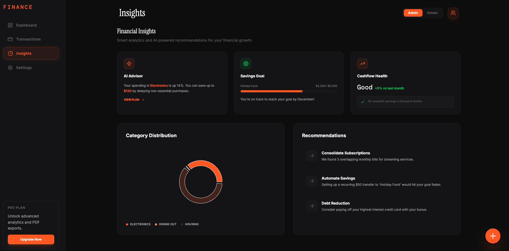

<div align="center">
  <br/>
  
  <br/>

  <h3>Finance | A Transaction Dashboard Application</h3>

  <div>
    
    
    
    
    
  </div>
</div>

## 📋 Table of Contents

- [🏗️ Introduction](#introduction)
- [🛠️ Tech Stack](#tech-stack)
- [✨ Key Features](#key-features)
- [🤸 Quick Start](#quick-start)
- [📂 Project Structure](#project-structure)
- [🔐 Role-Based Access](#role-based-access)
- [🎨Theme Engine](#theme-engine)

---

## <a name="introduction">🏗️ Introduction</a>

The **`Finance` Dashboard** is designed for modern wealth management. It focuses on visual excellence, smooth interactions, and actionable data. The application simulates a real-world SaaS environment with persistent state, multi-page routing, and responsive layouts.

## <a name="tech-stack">🛠️ Tech Stack</a>

- **Framework**: [React 19](https://react.dev/) + [Vite](https://vitejs.dev/)
- **Type Safety**: [TypeScript](https://www.typescriptlang.org/)
- **Styling**: [Tailwind CSS v4](https://tailwindcss.com/) (Next-generation CSS-first engine)
- **State Management**: [Zustand](https://docs.pmnd.rs/zustand/getting-started/introduction) (with Persistence)
- **Animations**: [Framer Motion](https://www.framer.com/motion/)
- **Data Visualization**: [Recharts](https://recharts.org/)
- **Icons**: [Lucide React](https://lucide.dev/)
- **Routing**: [React Router v6](https://reactrouter.com/)

## <a name="key-features">✨ Key Features</a>

### 1. Multi-Page Experience

Navigate seamlessly between core financial sections:

- **Dashboard**: High-level overview of balance, income, and expenses.
- **Transactions**: Filterable, searchable history with transaction management.
- **Insights**: AI-powered financial advice and savings goal tracking.
- **Settings**: Profile management and application preferences.

### 2. Intelligent Analytics

- **Balance Trends**: Interactive area charts showing wealth progression.
- **Category Breakdown**: Donut charts for visualizing spending habits.
- **AI Advisor**: Proactive insights highlighting spending anomalies and savings opportunities.

### 3. Role-Based Permissions (RBAC)

Simulated access control system:

- **Admin**: Full management rights (Add/Delete transactions).
- **Viewer**: Read-only access to all dashboards and data.

### 4. Dynamic Theme Engine

Supports **Dark** and **Light** modes with persistent storage.

- **Dark Mode**: Focused, high-contrast interface for night use.
- **Light Mode**: Clean, "Stone" themed palette for daylight productivity.

---

## <a name="quick-start">🤸 Quick Start</a>

Follow these steps to set up the project locally on your machine.

**Prerequisites**

Make sure you have the following installed on your machine:

- [Git](https://git-scm.com/)
- [Node.js](https://nodejs.org/en)
- [npm](https://www.npmjs.com/) (Node Package Manager)

**Cloning the Repository**

```bash
git clone https://github.com/itzzSVR-tech/Finance
cd Finance
```

**Installation**

Install the project dependencies using npm:

```bash
npm install
```

Start the local development server:

```bash
npm run dev
```

### Production Build

Generate an optimized production build:

```bash
npm run build
```

---

## <a name="project-structure">📂 Project Structure</a>

```text
src/
├── pages/                # Page components (Dashboard, Transactions, etc.)
├── store/                # Zustand state management
├── Layout.tsx            # Main Sidebar & Header wrappers
├── DashboardComponents.tsx # Reusable UI widgets
├── Charts.tsx            # Recharts visualization wrappers
├── App.tsx               # Routing and Modal logic
└── index.css             # Tailwind v4 configuration & design tokens
```

---

## <a name="role-based-access">🔐 Role-Based Access</a>

Toggle roles in the **Settings** or **Header** to see the UI adapt:

- **Admin**: Floating `+` button appears; `Trash` icons appear in lists.
- **Viewer**: All management controls are hidden for a read-only experience.

## <a name="theme-engine">🎨 Theme Engine</a>

The application uses a custom CSS-variable driven theme engine.

- **Variables**: Defined in `src/index.css` under `:root` and `[data-theme='light']`.
- **Injection**: Managed by a `useEffect` in `Layout.tsx` that syncs the `theme` state with the document root.

---

> [!TIP]
> This project was built with a focus on **Rich Aesthetics**. Try adding a transaction and watching the list animate smoothly!
